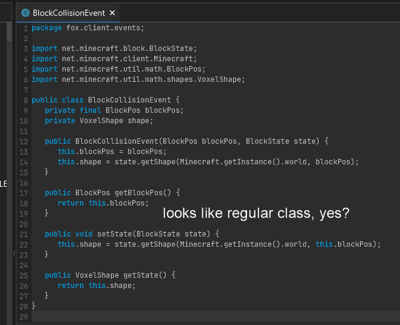
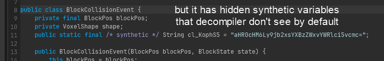
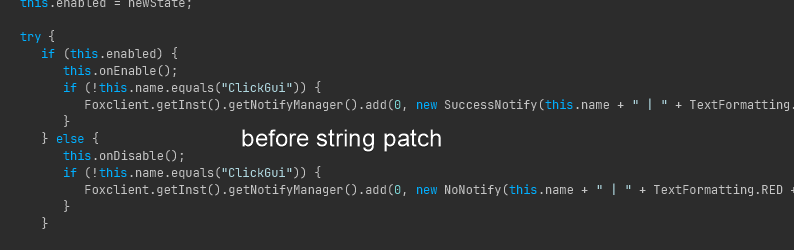
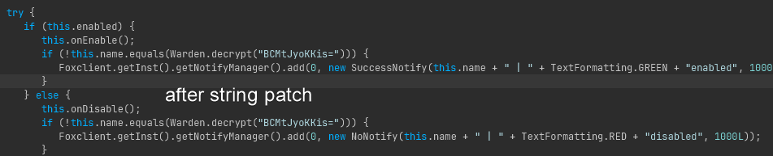

# CollapsePatcher

CollapsePatcher is a small Rust utility for embedding a CollapseLoader watermark and optionally encrypting string constants in Java JARs. It can patch JAR files by inserting a lightweight watermark field and (when enabled) replace literal strings with encrypted payloads that are decrypted at runtime by an injected Warden helper.

**Features**

- Watermark JARs by adding a compile-time, base64-encoded signature string constant.
- Optionally encrypt selected class string constants and call a Warden decrypt helper at runtime.
- Verify whether a JAR contains the CollapseLoader signature.

**Prerequisites**

- Rust and Cargo (stable) installed: https://www.rust-lang.org/tools/install

**Build**

```powershell
cargo build --release
```

**Usage**

Run via Cargo or the released binary. Subcommands:

- `patch` — patch a JAR and inject the Warden (encryption + watermark).
- `watermark` — only add the watermark fields to classes.
- `verify` — check a JAR for the CollapseLoader signature.

Examples (PowerShell / Windows):

```powershell
# Patch and let the tool choose output name
cargo run -- patch .\FoxClient.jar

# Patch and specify output
cargo run -- patch .\FoxClient.jar -o .\FoxClient-patched.jar

# Only add watermarks
cargo run -- watermark .\FoxClient.jar -o .\FoxClient-watermarked.jar

# Verify a JAR
cargo run -- verify .\FoxClient-patched.jar
```

Notes:

- The `-o` / `--out` option sets the output file path. When omitted the tool creates a suffixed filename next to the input.

**Screenshots**

- Before watermarking: 
- After watermarking: 

- Before string patch: 

- After string patch: 
